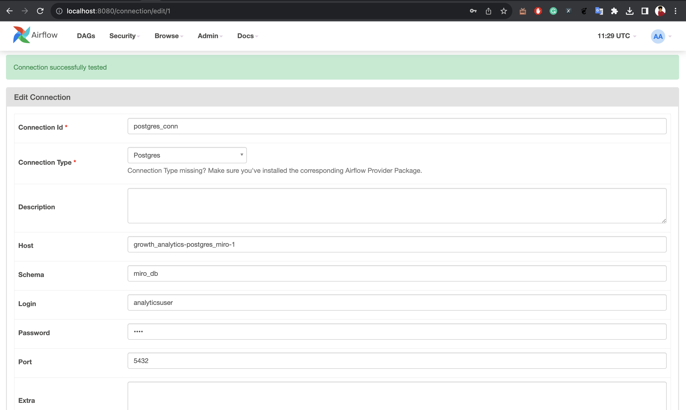
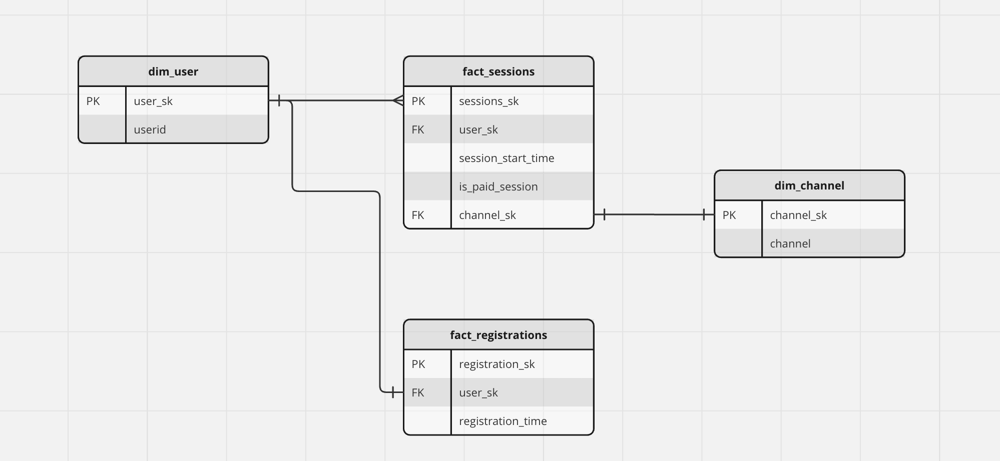
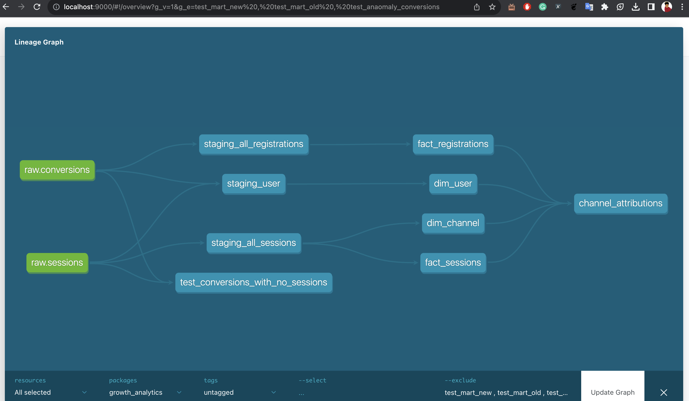
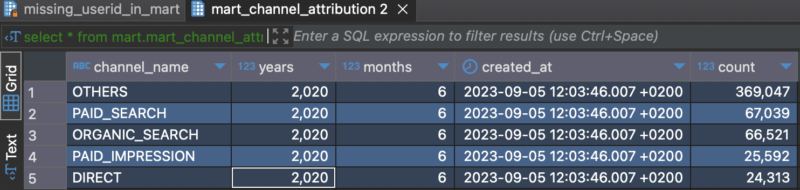

Welcome to the growth analytics project!

### Overview:
This project is an ETL project for ingestion and ELT code for gathering data for growth analytics. 
### Tech stack:
1. Database: Postgres13
2. ELT framework: DBT
3. Orchestrator: Airflow
4. elementary


### Pre-requisites:
The pre-request to run this project locally, the following pre-requisites must be met.
(Note: This local setup is tested against linux or unix based system and all the instructons in this readme to run and test the code assumes that you have an unix or linux based system)

1. docker desktop - to run and compose docker container which saves time    in preparing up the environment
2. python >= 3.7 (optional)
3. dbt (optional)
4. git

### Local development:
 - Step 1: Clone the repository into your local by  running the following command from your favourite terminal.
    ```bash
    $ git clone https://github.com/Catalyst18/growth_analytics.git
    ```
    This will clone the git repository and ```master``` branch is the default branch by default. If not please switch to the master branch by running the follwing command.
    ```bash
    $ git checkout master
    ```
 - Step 2: Once the repository is cloned please make sure your docker desktop or docker daemon is up and running. And execute the following command on the root of the cloned repository.
    ```bash
    $ docker-compose up && docker-compose rm -fsv
    ```
    This command will pull up images from the docker repo and also build the following services:
    1. growth_analytics-airflow-webserver-1 : Internal to airflow
    2. growth_analytics-airflow-worker-1 : Internal to airflow
    3. growth_analytics-airflow-scheduler-1 : Internal to airflow
    4. growth_analytics-airflow-triggerer-1 : Internal to airflow
    5. growth_analytics-postgres-1 : Internal to airflow
    6. growth_analytics-postgres_miro-1 : container where the dwh and marts are built
    7. growth_analytics-redis-1 : Internal to airflow

- Step 3: Once the containers are up and running, please make sure to check if the the following things are accessable.
    1. Check airflow UI : http://localhost:8080/home
        - username: airflow
        - password: airflow
    2. Check the postgres connection from any IDE of your choice.
    I use the amazing [dbeaver](https://dbeaver.io/) community edition for my use case.
        - hostname: localhost
        - database: miro_db
        - username: analyticsuser
        - pass: miro
        - port: 5438 (make sure this port is available on your local). If you still face some port issues please feel free to change the port configuration in the docker-compose.yml file under the section
        ```postgres_miro:```
- Step 4: Once you verified the airflow UI and the database connections as mentioned in step 3. Its time to configure the connection details in airflow.
    1. Login to the [airflow UI](http://localhost:8080/home) running from your local.
        - Click on the drop down ADMIN available on the toolbar on the airflow UI
        - Click on connections and click on Add new record and enter the following details.
            - Connection id: postgres_conn
            - Connection type: Postgres (select from the drop down)
            - Host: growth_analytics-postgres_miro-1
            - Schema: miro_db
            - Login: analyticsuser
            - Password: miro
            - Port: 5432 (Please note that this port is different from the port that we configured with the Dbeaver IDE.)
        - Click on test and verify your connection is successful.
        - Click on save.
        
    2. Its time to run the DAG named ```growth_etl``` and this will inturn ingest the data and create the data warehouse model and the mart.

### Data loading stategies:
 - Ingestion and schema details:
 The ingestion for the simplicities sake I used the postgres COPY command which is a bulk load mechanis to quickly ingest the data from my local.
 - Three tier data layer:
    - raw: raw tier is a schema which reflects the source, in this case the source files. There are two tables created
        - raw.sessions
        - raw.conversions
    - staging: Staging layer in the intermediate layer which is the landing layer of the datawarehouse schema
    - dwh: The data warehouse layer which has facts and dimensions modelled according to Kimball data modelling techniques(star schema dimensional modelling)
    - mart: The schema which contains data marts queries which are business facing or reporting tables according to the business needs.

### ER diagram:


### Data Lineage:



### Running local dbt:
 - I have also included and option to run dbt locally. For this a dbt installation is required.
Note: I assume that there is already a python REPL installed (python >=3.7))
 - Run the following command on the root folder of the project to install dbt and postgres adapted for dbt.
    ```bash
    $ pip install requirements.txt
    ```
    Copy and paste the following section under ```~/.dbt/profiles.yml```. (if proflies.yml doesnt exist then please feel free to create it)
    ```yaml
    growth_analytics:
        outputs:

            dev:
            type: postgres
            threads: 1
            host: localhost
            port: 5438
            user: analyticsuser
            pass: miro
            dbname: miro_db
            schema: public

            prod:
            type: postgres
            threads: [1 or more]
            host: [host]
            port: [port]
            user: [prod_username]
            pass: [prod_password]
            dbname: [dbname]
            schema: [prod_schema]

        target: dev
    ```
 - Navigate to the root directory of the project and 
 Run ```$ dbt debug``` to verify your connections.
 - To run the transformation after the ingestion step from airflow run to run the transformation pipeline. 
 Note: This will only work if atleast the airflow DAG is run atleast once after the dodker container boots up
 ```bash
    $ dbt deps && dbt run 
 ```

### DQ checks:
- I have added few dbt tests to check for uniquness, not null and some singular dbt tests in the project
- There are some anamolay's with the data, like duplicates, and registrations without session in the dataset etc. 
- I have added ```dbt tests``` that actually flags this. The idea is that we can have 
    - critical constraints check which we can use to stop the pipeline (Checks which cannot be allowed to propagate to staging and dwh or data marts) - eg: schema change, datatype change or non-acceptable values etc.
    - dq checks which are not critical but needs business justifications can be used to alert certain cases or confitions: eg: data freshness, threshold variance etc.
    - ```$dbt tests``` Run this to run dbt tests.

### Comments regarding the question:
- For modelling: Kimball approach was taken, as almost all the new modern DWH, still benifit from star schema with denormalised dims and facts, which inturn reduce the join costs. Almost with the new distributed databases, with the mechanism of sorting and partitioning, we can limit the number of data that is scanned (if the cost of the query planner is based on the data scanned.
- Without rules, there are number of options to see which channel has higher rate of converstions.
    - we can develop a metric that tracks average conversion time per channel and maybe improve the duration of the demo session.
- DQ checks - for critical constraints check and metric or freshness checks. We can also incorporate great expections and perform a truly TDD.

- Result of attribution channel:
    

- I have already taken this into consideration to model it keeping in mind of some user attributed and channel attributes. We can implement SCD2 depending on the database that we use or use dbt's snapshot to capture the SCD2, in that was we can do time series analysis to see how a change impacts the registrations.

- My thought process:
    - Ingestion into raw layer can be done using CDC.
    - SCD implementation and modelling the tables after speaking with different domains - using BUS matrix modelling techique.
    - Create seperate dags for alerting dbt tests and checks and slack integration.
    - performance tuning of queries or models as I believe a better software is the one that keeps updating throughout its lifespan.
    - Also I would take into consideration of how the reports are being buit and what is the process of acquiring the newly inserted data.
    - Data governance or role level access control depedning on the database or cloud. 

